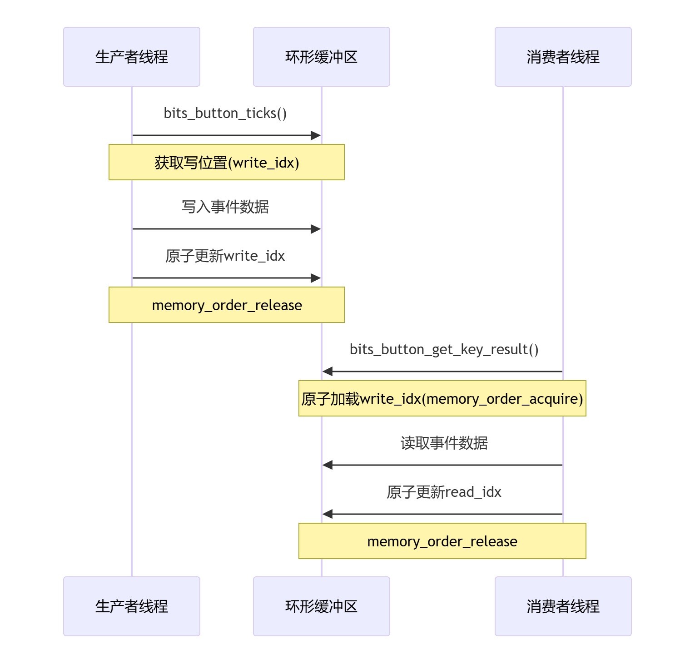

<h1 align="center">BitsButton</h1>

<p align="center">
<a href="https://github.com/530china/BitsButton/actions/workflows/stable-ci.yml">

</a>
<a href="https://github.com/530china/BitsButton/blob/master/LICENSE" target="blank">

</a>
<a href="https://deepwiki.com/530china/BitsButton"></a>
</p>

<h2> 一、简介👋</h2>
​​BitsButton是一款针对嵌入式系统优化的按键检测框架​​。通过创新的二进制位序列技术，它能高效处理单键、组合键（如Ctrl+C）和复杂按键序列（如单击→长按→双击），提供从按键按下到释放的全生命周期跟踪。独特的无锁环形缓冲设计确保多线程环境下事件不丢失，显著简化了传统按键逻辑的实现复杂度，特别适用于资源受限的嵌入式设备和复杂人机交互场景。

## 二、工程结构 

```
BitsButton/
├── bits_button.h/.c        # 🎯 核心按键处理库
├── test/                   # 🧪 完整测试框架
├── examples/               # 📚 示例代码
├── docs/                   # 📖 文档资源
├── simulator/              # 🎮 按键模拟器
├── .github/workflows/      # 🚀 CI/CD 自动化
│   └── stable-ci.yml       # 稳定的多平台测试配置
├── run_tests.bat           # 🚀 快速测试脚本
└── README.md               # 本文档
```

## 三、特性 🌱

>💡**1.按键事件回溯支持，创新使用位序列记录按键状态，1代表按下，0代表松开**

键值 | 说明
--- | ---
0b0 | 未按下
0b010 | 单击
0b01010 | 双击
0b01010...n | n连击
0b011 | 长按开始
0b0111| 长按保持
0b01110|长按结束
0b01011|短按然后长按
0b0101011 | 双击然后长按
0b01010..n11 | n连击然后长按

"直观的二进制表示让按键逻辑一目了然"

> 🎯**2.​高级按键检测**

功能 | 描述
--- | ---
​​组合按键 | 轻松定义多键组合（如Ctrl+C），智能冲突处理
​​序列识别 | 支持复杂按键序列（如单击-长按，单击-长按-双击等操作流）
​​事件类型 | 支持按下/抬起/单击/双击/连击/长按(开始/保持/结束)，完整覆盖按键生命周期

> 🚀**3.高性能内核​**
```c
typedef struct {
    bits_btn_result_t buffer[BITS_BTN_BUFFER_SIZE];
    atomic_size_t read_idx;   // 无锁原子操作
    atomic_size_t write_idx;
} bits_btn_ring_buffer_t;
```

- SPSC(单生产者单消费者)线程安全模型;
- 无锁设计+原子操作;
- 缓冲区溢出检测与统计;
- 轻量化处理（RAM <20字节/按键）;



> 🧩**4.​​模块化架构**

模块 | 功能
--- | ---
​​位运算优化引擎​ | 高效处理按键状态转换逻辑
硬件抽象层​ | 统一接口适配各类硬件平台
​​调试接口​​ | 可插拔日志输出

## 四、核心数据结构

```c
// 单按键对象
typedef struct button_obj_t {
    uint8_t  active_level : 1;
    uint8_t current_state : 3;
    uint8_t last_state : 3;
    uint16_t  key_id;
    uint16_t long_press_period_trigger_cnt;
    uint32_t state_entry_time;
    state_bits_type_t state_bits;
    const bits_btn_obj_param_t *param;
} button_obj_t;

// 组合按键对象
typedef struct {
    uint8_t key_count;              // 组合中按键数量
    uint16_t key_single_ids[BITS_BTN_MAX_COMBO_KEYS]; // 成员按键ID
    button_obj_t btn;               // 组合按键状态
    button_mask_type_t combo_mask;  // 组合掩码
    uint8_t suppress;               // 是否抑制成员按键事件
} button_obj_combo_t;

// 按键事件结果
typedef struct {
    uint16_t key_id;             // 触发按键ID
    btn_state_t event;           // 按键事件类型
    uint16_t long_press_period_trigger_cnt; // 长按周期计数
    key_value_type_t key_value;  // 按键值（序列位图）
} bits_btn_result_t;
```

| 字段                          | 用途说明                           | 位宽优化            |
|-------------------------------|----------------------------------|--------------------|
| `state_bits`                  | 按键序列历史状态位图               | 32位（可调整为64）支持32次按键事件 |
| `long_press_period_trigger_cnt` | 长按周期触发计数                  | 支持最大65535次触发 |

## 五、快速开始

### 0）编译环境要求
**⚠️ 编译器必须支持 C11 标准**

#### 核心依赖的 C11 特性：
- `_Atomic` 类型（内核无锁设计的核心）
- `<stdatomic.h>` 原子操作库（内存序模型基础）
- **匿名结构体**（简化核心数据结构设计）

### 1）快速测试

```bash
# 克隆项目
git clone https://github.com/530china/BitsButton.git
cd BitsButton

# 运行测试
./run_tests.bat  # Windows

# 或者使用CMake构建
cd test
mkdir build && cd build
cmake ..
make
./run_tests_new
```

### 2）集成到你的项目

1. 将 `bits_button.c` 和 `bits_button.h` 复制到你的项目中
2. 在你的代码中包含头文件：
   ```c
   #include "bits_button.h"
   ```
3. 开始使用！

### 3）基础使用示例
<details open>
<summary>点击展开/折叠C代码</summary>

- 首先将bits_button.c和bits_button.h包含进你的工程；
- [使用callback方式](examples/example_callback.c);
- [使用poll方式](examples/example_poll.c);
<br></details>

### 4）进阶调试

<details>
<summary>点击展开/折叠</summary>

- bits_button_init时，注册定义你的打印函数：
```c
int my_log_printf(const char* format, ...) {
    va_list args;
    va_start(args, format);
    int result = vprintf(format, args);
    va_end(args);
    return result;
}

bits_button_init(
    btns,
    ARRAY_SIZE(btns),
    btns_combo,
    ARRAY_SIZE(btns_combo),
    read_key_state,
    bits_btn_result_cb,
    my_log_printf
);
```
<br></details>

## 六、CI/CD 自动化 🚀

BitsButton 配备了完整的 **GitHub Actions CI/CD 流水线**：

### 🏗️ 多平台支持
平台 | 编译器 | 状态
--- | --- | ---
**Ubuntu** | GCC + Clang | ✅ 自动测试
**Windows** | MinGW-GCC | ✅ 自动测试  
**macOS** | Clang | ✅ 自动测试

### 📊 质量保证
- **自动化测试**: 每次提交自动运行完整测试套件
- **代码质量检查**: 基础静态分析，确保代码质量
- **多编译器验证**: 确保跨平台兼容性
- **测试结果上传**: 失败时自动保存调试信息

### 🛠️ CI配置文件
```yaml
# .github/workflows/stable-ci.yml
name: BitsButton 稳定CI
on: [push, pull_request]
jobs:
  test:
    strategy:
      matrix:
        os: [ubuntu-latest, windows-latest, macos-latest]
        compiler: [gcc, clang]
```

## 七、按键模拟器
- 为了脱离开发板进行程序的逻辑验证，我用python编写了一个按键模拟器，可以直接在pc端验证程序的逻辑，详情见：[按键模拟器](simulator/ButtonSimulator.md)

## 八、测试框架亮点🧪

BitsButton 配备了完整的**按键测试用例**，专为嵌入式C项目设计：
- 详情见：[按键测试用例](test/README.md)

### 🏗️ 分层架构设计
- **核心层(core/)**: 测试框架基础设施和运行器
- **工具层(utils/)**: 模拟工具、时间控制、断言增强
- **测试层(cases/)**: 按功能分类的测试用例
- **配置层(config/)**: 统一的测试参数管理

### 📊 测试覆盖全面
测试类型 | 覆盖内容 | 测试数量
--- | --- | ---
**基础功能** | 单击、双击、长按、连击 | 5+ 测试
**组合按键** | 多键组合、组合长按 | 4+ 测试  
**边界条件** | 超时、消抖、极限情况 | 6+ 测试
**性能测试** | 高频按键、并发处理 | 5+ 测试

## ⚡ 其他
- 本项目基于本人实际开发中遇到的一些按键驱动使用体验问题，在他人项目（见参考链接）的思想基础上，开发的此按键检测框架，感谢帮助思考我的小伙伴[shawnfeng0](https://github.com/shawnfeng0)以及正在使用此模块的小伙伴，欢迎一起开发改进！

## 🤝 参与开发
欢迎贡献代码！当前路线图
- [x] 基础按键检测功能
- [x] 组合按键支持
- [x] 按键结果高性能缓冲区支持
- [x] 按键模拟器Window环境支持
- [x] 按键模拟器Linux/macOS环境支持
- [x] **自动化测试框架支持** ✨ **已完成完整测试框架！**
- [x] **CI/CD集成支持** ✨ **已完成稳定的多平台CI！**
- [x] 更多应用示例
- [ ] 测试覆盖率统计
- [ ] 性能基准测试
- [ ] 更多硬件平台适配

## 💬 参考链接
- [MultiButton](https://github.com/0x1abin/MultiButton)
- [FlexibleButton](https://github.com/murphyzhao/FlexibleButton/tree/master)
- [安富莱按键FIFO思想](https://www.armbbs.cn/forum.php?mod=viewthread&tid=111527&highlight=%B0%B4%BC%FC)
- [easy_button](https://github.com/bobwenstudy/easy_button#)