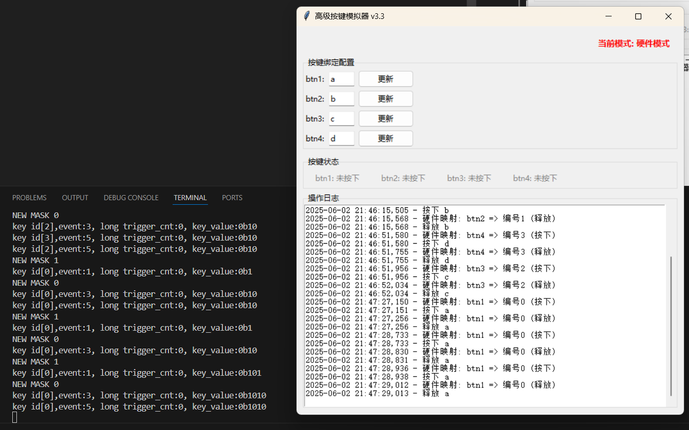

# BitsButton 按键模拟器

## 简介
BitsButton 按键模拟器是一个跨平台的按键模拟工具，支持硬件和软件两种模式。该工具提供了直观的图形界面，允许用户配置按键绑定、监控按键状态并记录操作日志

## 目录结构

```
simulator/
├── adapter_layer/           # C语言适配层
│   ├── button_adapter.c     # 适配层实现（连接C库和Python模拟器）
│   ├── button_adapter.h     # 适配层接口定义
│   ├── button_types.h       # 按键类型定义
│   └── Makefile             # 编译配置
├── python_simulator/        # Python实现的模拟器
│   ├── advanced_v2_sim.py   # 高级模拟器实现
│   ├── button_ctrl.py       # 按键控制逻辑
│   ├── button_ui.py         # 用户界面实现
│   ├── event_logger.py      # 事件日志记录
│   └── config_manager.py    # 配置管理
├── key_bindings.json        # 按键绑定配置文件
├── run.py                   # 主运行脚本
├── output/                  # 编译输出目录
│   ├── libbutton.dll        # Windows动态库
│   ├── libbutton.so         # Linux动态库
│   └── libbutton.dylib      # macOS动态库
└── ButtonSimulator.md       # 本文档
```

## 主要特性

- ​跨平台支持​​：Windows,Linux 和 macOS
- 双模式运行​​：
    - ​硬件模式​​：通过动态库与底层硬件交互
    - ​软件模式​​：纯软件模拟按键行为
- 动态配置​​：实时修改按键绑定并保存配置
- ​状态监控​​：实时显示按键状态（按下/释放）
- ​详细日志​​：记录所有按键操作和系统事件
- ​线程安全设计​​：确保高性能和稳定性


## 快速启动
### 1. 安装准备
确保已安装 Python 3.6 或更高版本
```bash
# 查看Python版本
python --version  # Windows/Linux/macOS通用
python3 --version # Linux/macOS备选
```

### 2. 运行模拟器

```bash
# 进入模拟器目录
cd BitsButton/simulator

# 通用命令
python run.py                   # 软件模式（所有平台）
python run.py --mode hardware   # 硬件模式
python run.py --help            # 查看帮助

# Linux/macOS备选命令（若python指向Python 2）
python3 run.py                  # 软件模式
python3 run.py --mode hardware  # 硬件模式
```
> ​提示​​：硬件模式需要编译器支持，具体参考"硬件模式说明"部分

### 3. 界面操作

1. **​修改按键绑定**​​：
- 在输入框中输入新按键（单字母）
- 点击"更新"保存
2. **使用按键​**​：按下配置键观察状态变化
3. **查看日志**​​：操作记录实时显示在下方面板

## 硬件模式说明
### 编译器要求
平台 | 编译器 | 安装指南
--- | --- | ---
Windows |MinGW | 下载安装：https://sourceforge.net/projects/mingw/
Linux|gcc/build-essential|sudo apt install build-essential
macOS|Xcode 命令行工具|xcode-select --install

### 常见问题解决
- 硬件加载失败​​：
```bash
# macOS特殊处理
xattr -d com.apple.quarantine output/libbutton.dylib
```
- 编译器问题​​：
```bash
# 尝试自动安装编译器
python run.py --install-compiler
```

## 配置文件
按键绑定保存在**key_bindings.json**中：
```json
{
  "mappings": [
    {
      "id": "btn1",
      "key": "a",
      "color": "red",
      "btn_number": 0
    },
    {
      "id": "btn2",
      "key": "b",
      "color": "orange",
      "btn_number": 1
    }
  ]
}
```

- id：按钮标识符
- key：绑定的键盘按键
- color：按下时显示的颜色
- btn_number：硬件按钮编号（硬件模式使用）

> 提示：修改配置文件后需重启应用生效

效果图如下：
UI如下图：

